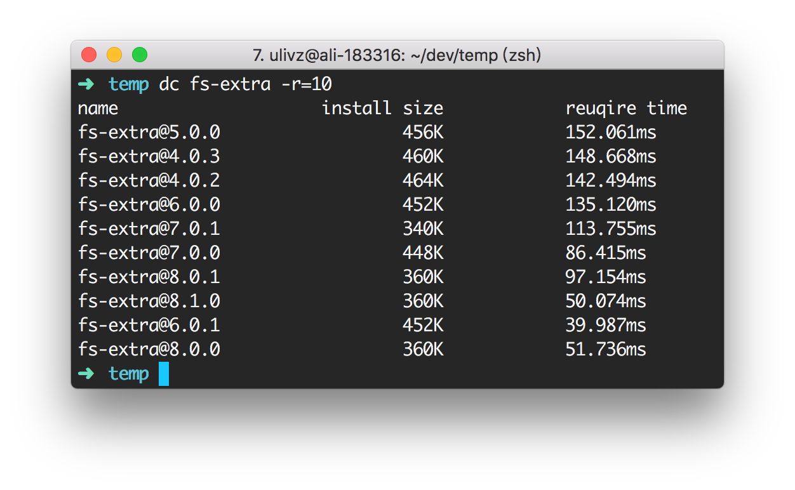

# depcost

[](https://npmjs.com/package/depcost) [](https://npmjs.com/package/depcost) [](https://packagephobia.now.sh/result?p=depcost)

<p align="center">
  <br />
  <small><i>e.g. retrieve the time & space cost of latest 5 versions of <code>fs-extra</code>.</i></small>
</p>

## Introduction

**depcost** (abbr. **dc**) is a cli tool for you to judge whether a node module deserve your favor via knowing the time and space cost of a dependency.

## Features

- With **Require time**, you will know if the dependency you are using now is likely to **slow down** your node application.
- With **Install size** of a dependency, you will know if the dependency is too cumbersome and **wastes your disk.**
- Quickly specify the latest released versions.

## Install

```bash
tnpm install depcost -g
```

## Usage

Using `depcost` or its shortcut `dc`:

```bash
Usage:
  $ depcost [...pkgs]

For more info, run any command with the `--help` flag:
  $ depcost --help

Options:
  -t, --track                             Whether to keep temp directory.
  -r, --latest-versions <latestVersions>  Specify the count of latest versions.
  -v, --versions <versions>               Select specific versions.
  -l, --log-level <logLevel>              log level of npmlog under the hood.
  -l, --npm-client <npmClient>            set npm client, defaults to npm.
  -d, --debug                             Shortcut to set log level to "debug".
  -h, --help                              Display this message
  -v, --version                           Display version number
```

Examples:

```bash
depcost [package]
depcost [package] --log-level=info
depcost [package] --debug
depcost [package@version]
depcost [package1] [package2] [package3]
depcost --debug
depcost [package] --latest-versions=3
depcost [package] --versions=1.0.0,2.0.0
```

## Global Config

You can set global options at `~/.depcostrc` with ini syntax. 

e.g., set npmClient to `tnpm` globally:

```bash
echo 'npmClient=tnpm' > ~/.depcostrc
```

## Contributing

1. Fork it!
2. Create your feature branch: `git checkout -b my-new-feature`
3. Commit your changes: `git commit -am 'Add some feature'`
4. Push to the branch: `git push origin my-new-feature`
5. Submit a pull request :D

## Author

**depcost** © [ULIVZ](https://github.com/ulivz) under [Richlab Team](https://www.yuque.com/richlab/join-us/invitation), Released under the [MIT](./LICENSE) License.<br>


